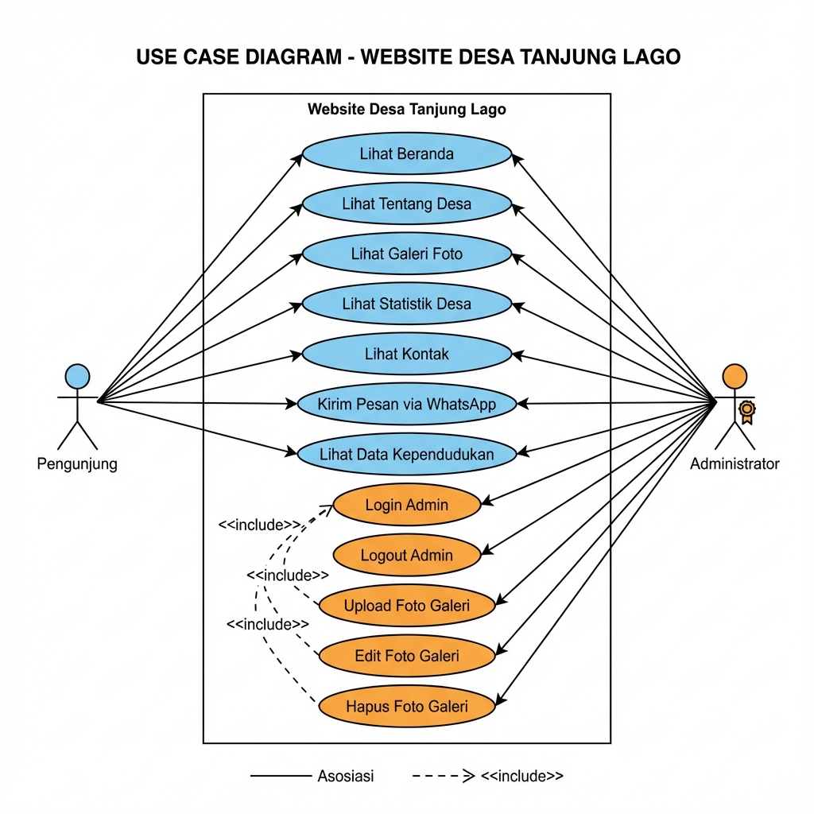
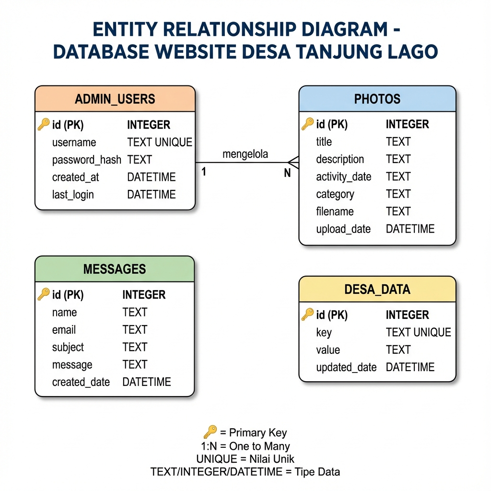
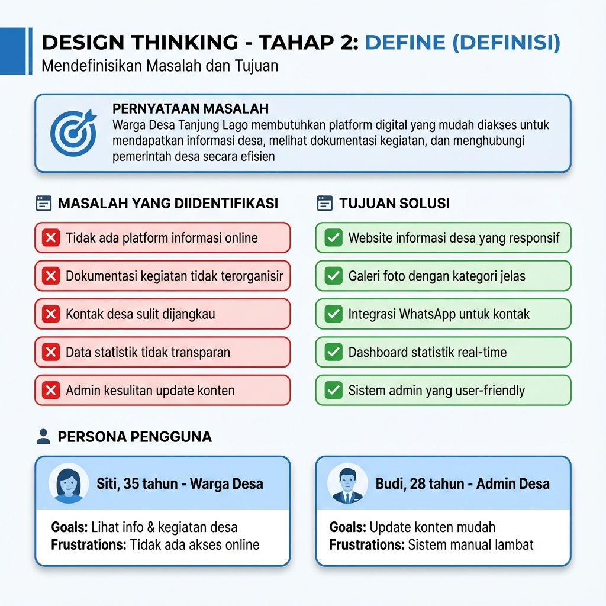
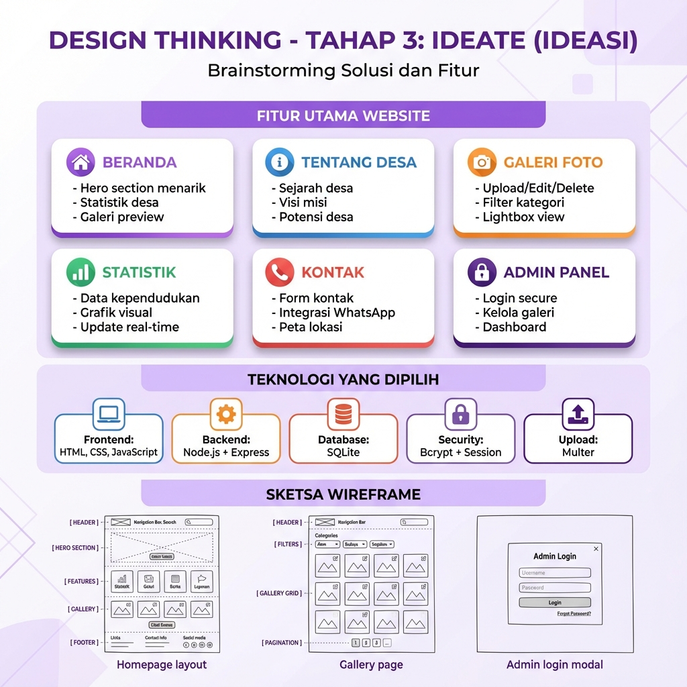
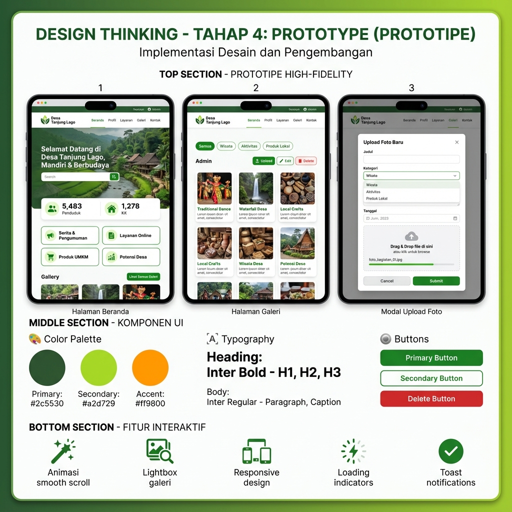
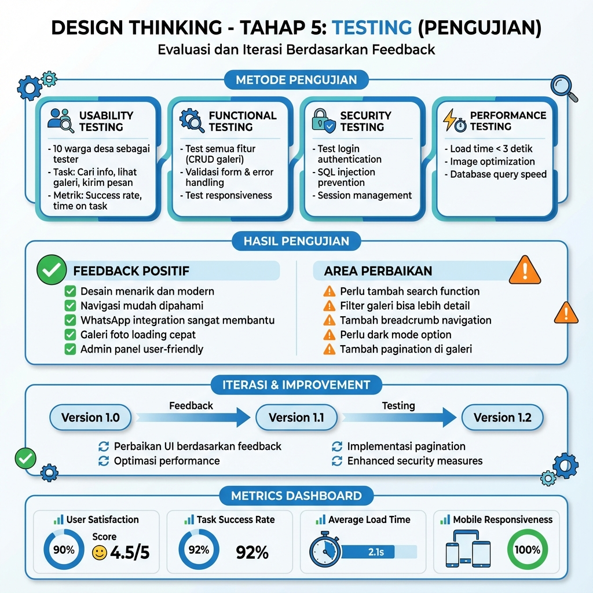
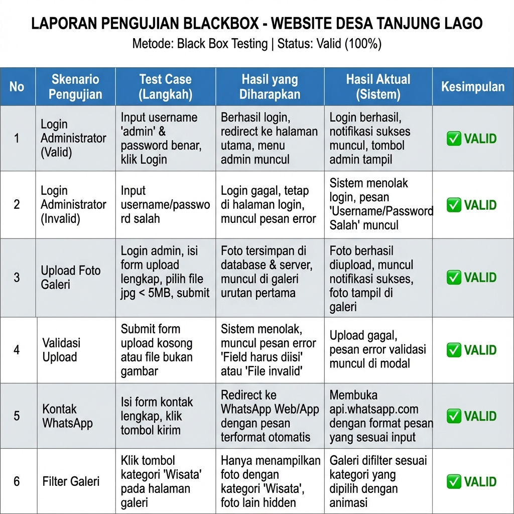

# 📊 DOKUMENTASI DIAGRAM - WEBSITE DESA TANJUNG LAGO

Dokumentasi lengkap diagram sistem untuk Website Desa Tanjung Lago yang mencakup Use Case Diagram, Activity Diagram, ERD, dan UI/UX Design Thinking Process.

---

## 📁 Lokasi File Gambar

Semua diagram tersimpan di folder: **`public/images/`**

---

## 🎯 1. USE CASE DIAGRAM

### Deskripsi
Diagram ini menunjukkan interaksi antara pengguna (Pengunjung dan Administrator) dengan sistem website.

### Aktor
- **Pengunjung**: Masyarakat umum yang mengakses website
- **Administrator**: Pengelola website yang mengelola konten (memiliki akses yang sama dengan Pengunjung + fitur tambahan)

### Use Case yang Dapat Diakses Kedua Aktor
**Fitur Bersama (Pengunjung & Administrator):**
- Lihat Beranda
- Lihat Tentang Desa
- Lihat Galeri Foto
- Lihat Statistik Desa
- Lihat Kontak
- Kirim Pesan via WhatsApp
- Lihat Data Kependudukan

**Fitur Khusus Admin (Hanya Administrator):**
- Login Admin
- Logout Admin
- Upload Foto Galeri
- Edit Foto Galeri
- Hapus Foto Galeri

### Relasi
- **Administrator dapat melakukan semua yang dilakukan Pengunjung** (use case yang sama)
- **Perbedaan utama**: Administrator memiliki akses tambahan untuk Login, Logout, dan CRUD galeri foto
- Fitur Upload/Edit/Hapus Foto memerlukan **Login Admin** terlebih dahulu (include relationship)

---

## 🔄 2. ACTIVITY DIAGRAM

### 2.1 Activity Diagram: Login Admin

**Proses:**
1. Admin membuka halaman login
2. Input username dan password
3. Sistem validasi input
4. Cek database untuk username
5. Verifikasi password dengan bcrypt
6. Jika berhasil: buat session dan update UI
7. Jika gagal: tampilkan error dan ulangi

**Fitur Keamanan:**
- Password hashing dengan bcrypt
- Session management
- Rate limiting (5 attempts per 15 menit)
- Error handling yang aman

---

### 2.2 Activity Diagram: Upload Foto Galeri

**Proses:**
1. Cek autentikasi admin
2. Buka halaman galeri dan klik upload
3. Tampilkan modal upload
4. Isi form (judul, kategori, deskripsi, tanggal, file)
5. Validasi form dan file
6. Simpan file ke folder `/uploads`
7. Generate unique filename
8. Simpan data ke database
9. Refresh galeri dan tampilkan notifikasi

**Validasi:**
- Format file: hanya image (jpg, png, gif, webp)
- Ukuran maksimal: 5MB
- Field wajib: Judul dan Kategori

---

## 🗄️ 3. ENTITY RELATIONSHIP DIAGRAM (ERD)

### Struktur Database

#### Tabel: ADMIN_USERS
Menyimpan data administrator website.

| Kolom | Tipe | Keterangan |
|-------|------|------------|
| id | INTEGER (PK) | ID unik admin |
| username | TEXT (UNIQUE) | Username untuk login |
| password_hash | TEXT | Password ter-hash (bcrypt) |
| created_at | DATETIME | Waktu pembuatan akun |
| last_login | DATETIME | Waktu login terakhir |

#### Tabel: PHOTOS
Menyimpan data foto galeri kegiatan desa.

| Kolom | Tipe | Keterangan |
|-------|------|------------|
| id | INTEGER (PK) | ID unik foto |
| title | TEXT | Judul foto/kegiatan |
| description | TEXT | Deskripsi detail |
| activity_date | TEXT | Tanggal kegiatan (YYYY-MM-DD) |
| category | TEXT | Kategori: Wisata/Aktivitas/Produk Lokal |
| filename | TEXT | Nama file di folder uploads |
| upload_date | DATETIME | Waktu upload |

#### Tabel: MESSAGES
Menyimpan log pesan dari form kontak.

| Kolom | Tipe | Keterangan |
|-------|------|------------|
| id | INTEGER (PK) | ID unik pesan |
| name | TEXT | Nama pengirim |
| email | TEXT | Email pengirim |
| subject | TEXT | Subjek pesan |
| message | TEXT | Isi pesan |
| created_date | DATETIME | Waktu pesan dikirim |

#### Tabel: DESA_DATA
Menyimpan data statistik desa (key-value).

| Kolom | Tipe | Keterangan |
|-------|------|------------|
| id | INTEGER (PK) | ID unik data |
| key | TEXT (UNIQUE) | Nama data (contoh: total_penduduk) |
| value | TEXT | Nilai data |
| updated_date | DATETIME | Waktu update terakhir |

### Relasi Antar Tabel
- **ADMIN_USERS → PHOTOS** (1:N): Satu admin dapat mengelola banyak foto

---

## 🎨 4. UI/UX DESIGN THINKING PROCESS

### 4.1 Tahap 1: EMPATHIZE (Empati)

**Tujuan:** Memahami kebutuhan pengguna website

**Pengguna Utama:**
1. **Warga Desa & Pengunjung** (18-65 tahun)
   - Kebutuhan: Informasi desa, galeri kegiatan
   - Pain Points: Sulit akses info, tidak ada dokumentasi online

2. **Admin Desa** (25-50 tahun)
   - Kebutuhan: Kelola konten, update info
   - Pain Points: Sistem manual, tidak efisien

**Metode Riset:**
- 📋 Wawancara dengan warga
- 📊 Survey kebutuhan informasi
- 👀 Observasi aktivitas desa
- 📱 Analisis website desa lain

**Temuan Utama:**
- Warga butuh akses info cepat
- Galeri foto kegiatan penting
- Kontak langsung via WhatsApp
- Data statistik transparan
- Admin butuh sistem mudah

---

### 4.2 Tahap 2: DEFINE (Definisi)

**Pernyataan Masalah:**
> "Warga Desa Tanjung Lago membutuhkan platform digital yang mudah diakses untuk mendapatkan informasi desa, melihat dokumentasi kegiatan, dan menghubungi pemerintah desa secara efisien"

**Masalah yang Diidentifikasi:**
- ❌ Tidak ada platform informasi online
- ❌ Dokumentasi kegiatan tidak terorganisir
- ❌ Kontak desa sulit dijangkau
- ❌ Data statistik tidak transparan
- ❌ Admin kesulitan update konten

**Tujuan Solusi:**
- ✅ Website informasi desa yang responsif
- ✅ Galeri foto dengan kategori jelas
- ✅ Integrasi WhatsApp untuk kontak
- ✅ Dashboard statistik real-time
- ✅ Sistem admin yang user-friendly

**Persona Pengguna:**
- **Siti, 35 tahun** - Warga Desa
  - Goals: Lihat info & kegiatan desa
  - Frustrations: Tidak ada akses online

- **Budi, 28 tahun** - Admin Desa
  - Goals: Update konten mudah
  - Frustrations: Sistem manual lambat

---

### 4.3 Tahap 3: IDEATE (Ideasi)

**Fitur Utama Website:**

1. 🏠 **BERANDA**
   - Hero section menarik
   - Statistik desa
   - Galeri preview

2. ℹ️ **TENTANG DESA**
   - Sejarah desa
   - Visi misi
   - Potensi desa

3. 📸 **GALERI FOTO**
   - Upload/Edit/Delete
   - Filter kategori
   - Lightbox view

4. 📊 **STATISTIK**
   - Data kependudukan
   - Grafik visual
   - Update real-time

5. 📞 **KONTAK**
   - Form kontak
   - Integrasi WhatsApp
   - Peta lokasi

6. 🔐 **ADMIN PANEL**
   - Login secure
   - Kelola galeri
   - Dashboard

**Teknologi yang Dipilih:**
- 💻 Frontend: HTML, CSS, JavaScript
- ⚙️ Backend: Node.js + Express
- 🗄️ Database: SQLite
- 🔒 Security: Bcrypt + Session
- 📤 Upload: Multer

---

### 4.4 Tahap 4: PROTOTYPE (Prototipe)

**Prototipe High-Fidelity:**

**Halaman Beranda:**
- Navigation bar dengan logo "Desa Tanjung Lago"
- Hero section dengan gambar desa
- Statistics cards (5,483 Penduduk, 1,278 KK)
- Feature cards grid
- Gallery preview

**Halaman Galeri:**
- Filter buttons (Semua, Wisata, Aktivitas, Produk Lokal)
- Photo grid layout (3 columns)
- Admin buttons (Upload, Edit, Delete)
- Photo cards dengan titles

**Modal Upload Foto:**
- Form fields (Judul, Kategori, Deskripsi, Tanggal)
- File upload area dengan drag-drop
- Submit dan Cancel buttons

**Komponen UI:**

🎨 **Color Palette:**
- Primary: #2c5530 (hijau)
- Secondary: #a2d729 (lime)
- Accent: #ff9800 (orange)

🔤 **Typography:**
- Heading: Inter Bold
- Body: Inter Regular

🔘 **Buttons:**
- Primary button (hijau)
- Secondary button (outline)
- Delete button (merah)

**Fitur Interaktif:**
- ✨ Animasi smooth scroll
- 🖼️ Lightbox galeri
- 📱 Responsive design
- ⚡ Loading indicators
- ✅ Toast notifications

---

### 4.5 Tahap 5: TESTING (Pengujian)

**Metode Pengujian:**

1. 👥 **USABILITY TESTING**
   - 10 warga desa sebagai tester
   - Task: Cari info, lihat galeri, kirim pesan
   - Metrik: Success rate, time on task

2. 🔍 **FUNCTIONAL TESTING**
   - Test semua fitur (CRUD galeri)
   - Validasi form & error handling
   - Test responsiveness

3. 🔒 **SECURITY TESTING**
   - Test login authentication
   - SQL injection prevention
   - Session management

4. ⚡ **PERFORMANCE TESTING**
   - Load time < 3 detik
   - Image optimization
   - Database query speed

**Hasil Pengujian:**

**Feedback Positif:**
- ✅ Desain menarik dan modern
- ✅ Navigasi mudah dipahami
- ✅ WhatsApp integration sangat membantu
- ✅ Galeri foto loading cepat
- ✅ Admin panel user-friendly

**Area Perbaikan:**
- ⚠️ Perlu tambah search function
- ⚠️ Filter galeri bisa lebih detail
- ⚠️ Tambah breadcrumb navigation
- ⚠️ Perlu dark mode option
- ⚠️ Tambah pagination di galeri

**Iterasi & Improvement:**
- 🔄 Perbaikan UI berdasarkan feedback
- 🔄 Optimasi performance
- 🔄 Penambahan fitur search
- 🔄 Implementasi pagination
- 🔄 Enhanced security measures

**Metrics Dashboard:**
- 📊 User Satisfaction: 4.5/5
- 📊 Task Success Rate: 92%
- 📊 Average Load Time: 2.1s
- 📊 Mobile Responsiveness: 100%

---

---

## ✅ 5. BLACKBOX TESTING

### Skenario Pengujian

Laporan ini mencakup pengujian fungsionalitas utama website dengan metode **Black Box Testing**, di mana pengujian dilakukan tanpa melihat kode program (hanya input dan output).

**Test Items yang Diuji:**

1. **Login Administrator**
   - **Valid**: Input kredensial benar → Redirect ke dashboard admin ✅
   - **Invalid**: Input kredensial salah → Pesan error muncul ✅

2. **Manajemen Galeri**
   - **Upload**: Upload foto dengan data valid → Foto tersimpan ✅
   - **Validasi**: Submit form kosong → Error "field required" muncul ✅

3. **Fitur Publik**
   - **Kontak WhatsApp**: Isi form dan kirim → Redirect ke API WhatsApp ✅
   - **Filter Galeri**: Klik kategori → Foto terfilter sesuai kategori ✅

**Kesimpulan Pengujian:**
- Semua fitur utama berjalan sesuai harapan
- Validasi input berfungsi dengan baik
- Tidak ditemukan error kritikal
- **Status Akhir: VALID (100%)**

---

## 📋 Daftar Lengkap File Gambar

| No | Nama File | Deskripsi | Ukuran |
|----|-----------|-----------|--------|
| 1 | `use_case_diagram.png` | Use Case Diagram sistem | 563 KB |
| 2 | `activity_diagram_combined.png` | Activity Diagram (Login + Upload) | 450 KB |
| 3 | `erd_database.png` | Entity Relationship Diagram | 474 KB |
| 4 | `blackbox_testing.png` | Laporan Blackbox Testing | 850 KB |
| 5 | `design_thinking_1_empathize.png` | Design Thinking - Empathize | 784 KB |
| 6 | `design_thinking_2_define.png` | Design Thinking - Define | 719 KB |
| 7 | `design_thinking_3_ideate.png` | Design Thinking - Ideate | 664 KB |
| 8 | `design_thinking_4_prototype.png` | Design Thinking - Prototype | 704 KB |
| 9 | `design_thinking_5_testing.png` | Design Thinking - Testing | 777 KB |

**Total:** 9 file gambar

---

## 💡 Cara Menggunakan Diagram

### Untuk Laporan KKN
1. Buka folder `public/images/`
2. Copy gambar yang dibutuhkan ke dokumen laporan
3. Tambahkan caption dan penjelasan sesuai konteks

### Untuk Presentasi
1. Import gambar ke PowerPoint/Google Slides
2. Gunakan sebagai visual aid saat presentasi
3. Jelaskan setiap diagram secara detail

### Untuk Dokumentasi Teknis
1. Embed gambar di README.md atau dokumentasi
2. Link ke file gambar dengan path relatif
3. Tambahkan penjelasan teknis di bawah setiap gambar

---

## 🔗 Referensi

- **Use Case Diagram**: Menunjukkan fungsionalitas sistem dari perspektif pengguna
- **Activity Diagram**: Menggambarkan alur proses bisnis dan logika sistem
- **ERD**: Menampilkan struktur database dan relasi antar tabel
- **Design Thinking**: Proses desain UI/UX dari empati hingga testing

---

## 📝 Catatan

> **Semua diagram dibuat dalam Bahasa Indonesia** untuk memudahkan pemahaman dan penggunaan dalam laporan KKN.

> **Format PNG** dipilih untuk kualitas gambar yang baik dan kompatibilitas universal.

> **Lokasi Penyimpanan**: `d:\websandi\public\images\` - dapat diakses melalui web server di `/public/images/`

---

**Dibuat untuk:** Website Desa Tanjung Lago  
**Tanggal:** 15 Desember 2025  
**Versi:** 1.0
